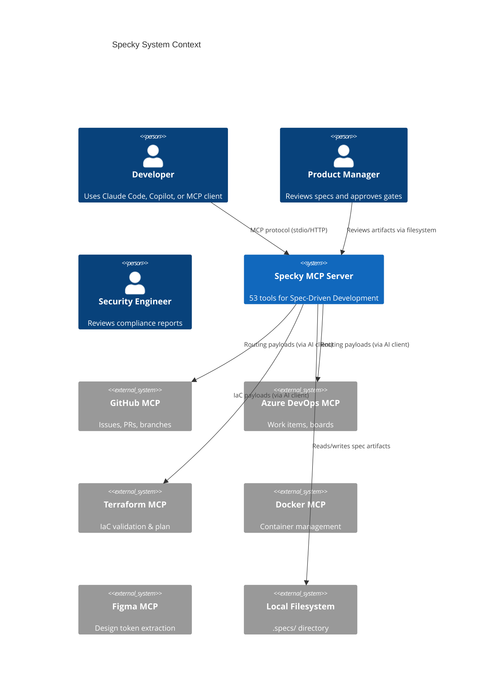
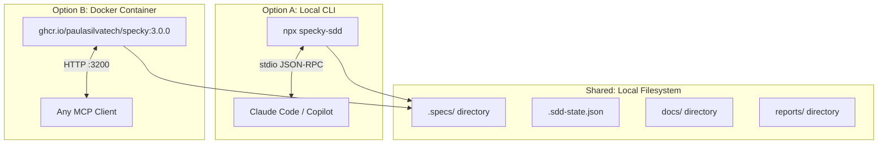
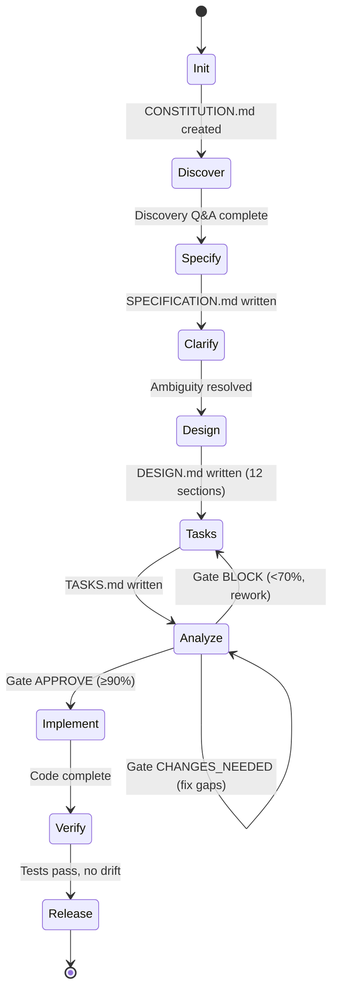
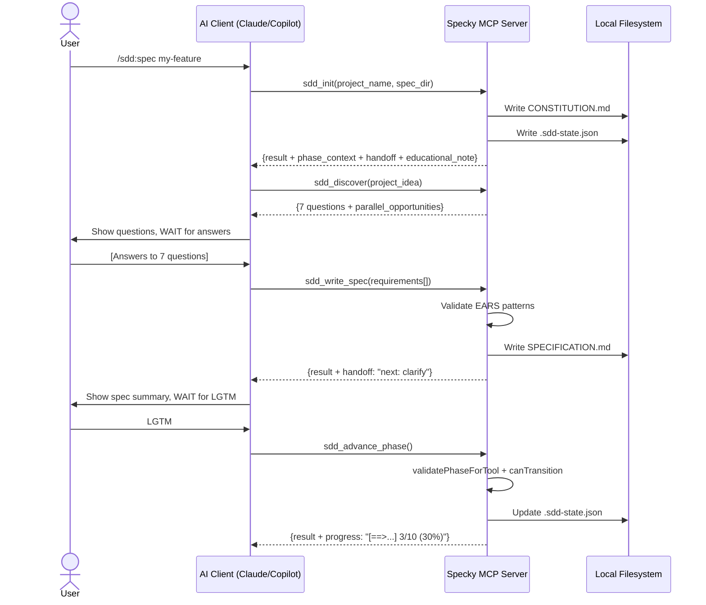
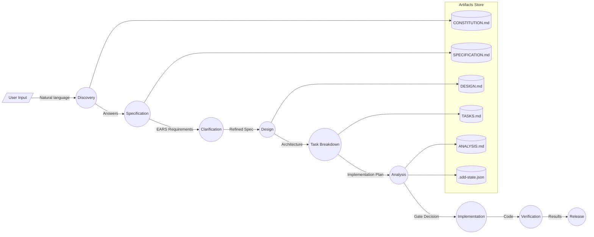
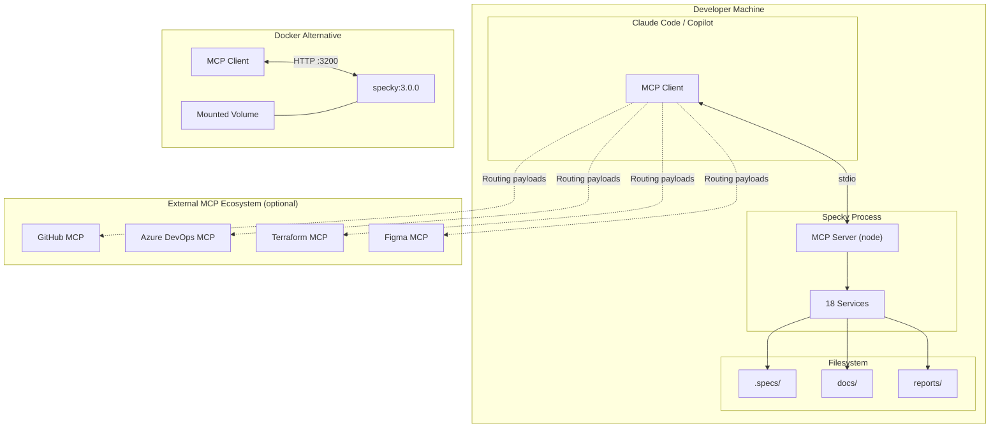
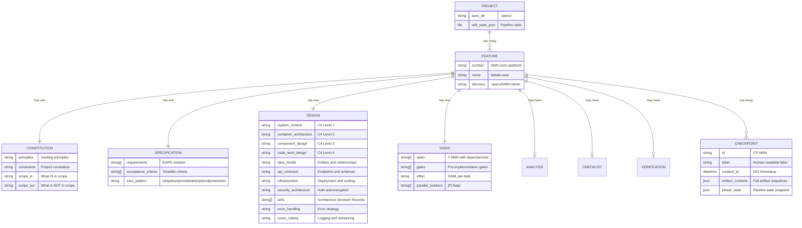
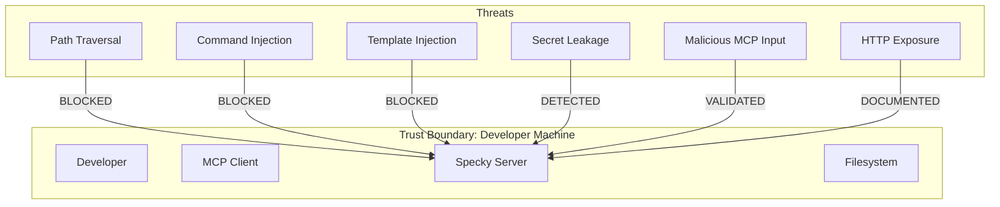

# Specky v3.0.0 — System Design Document

> Complete system design covering architecture, security, data model, infrastructure, and all engineering decisions.

**Date:** 2026-03-27
**Version:** 3.0.0
**Author:** Paula Silva + Claude Opus 4.6

---

## 1. System Context (C4 Level 1)

### Who Uses Specky



### External Integrations

| System | Integration Type | Data Exchanged |
|--------|-----------------|----------------|
| GitHub MCP | MCP-to-MCP routing | Branch names, PR payloads, issue payloads |
| Azure DevOps MCP | MCP-to-MCP routing | Work item payloads (User Stories, Tasks, Bugs) |
| Jira MCP | MCP-to-MCP routing | Issue payloads (Stories, Tasks, Epics) |
| Terraform MCP | MCP-to-MCP routing | HCL configuration for validation |
| Docker MCP | MCP-to-MCP routing | Dockerfile, docker-compose |
| Figma MCP | MCP-to-MCP routing | FigJam diagram payloads |
| MarkItDown MCP | MCP-to-MCP routing | Document conversion (PDF/DOCX/PPTX) |

**Key architectural decision:** Specky never communicates directly with external services. It generates structured payloads and the AI client (Claude/Copilot) routes them to the appropriate MCP server. This means **zero outbound network calls** from Specky.

---

## 2. Container Architecture (C4 Level 2)

### Deployment Options



### Communication Protocols

| Mode | Protocol | Transport | Security |
|------|----------|-----------|----------|
| **stdio** (default) | JSON-RPC 2.0 | stdin/stdout | Process isolation, no network |
| **HTTP** (`--http`) | JSON-RPC 2.0 over HTTP | StreamableHTTPServerTransport | localhost only, session UUID |

### Endpoints (HTTP mode)

| Endpoint | Method | Purpose |
|----------|--------|---------|
| `/mcp` | POST | MCP protocol requests |
| `/mcp` | GET | SSE session management |
| `/mcp` | DELETE | Session cleanup |
| `/health` | GET | Liveness check → `{"status":"ok","version":"3.0.0"}` |

---

## 3. Component Design (C4 Level 3)

### Service Architecture

```mermaid
flowchart TB
  subgraph "MCP Layer"
    Server["McpServer"]
    Transport["StdioTransport / HTTPTransport"]
  end

  subgraph "Tool Layer (53 tools, 15 registration files)"
    Pipeline["pipeline.ts (8)"]
    Quality["quality.ts (5)"]
    Viz["visualization.ts (4)"]
    Docs["documentation.ts (5)"]
    Infra["infrastructure.ts (3)"]
    Env["environment.ts (3)"]
    Integration["integration.ts (5)"]
    Transcript["transcript.ts (3)"]
    Input["input.ts (3)"]
    Testing["testing.ts (2)"]
    Checkpoint["checkpoint.ts (3)"]
    Turnkey["turnkey.ts (1)"]
    PBT["pbt.ts (1)"]
    Utility["utility.ts (6)"]
    Analysis["analysis.ts (1)"]
  end

  subgraph "Enrichment Layer"
    RB["ResponseBuilder"]
    MG["MethodologyGuide"]
    DG["DependencyGraph"]
  end

  subgraph "Service Layer (18 services)"
    FM["FileManager"]
    SM["StateMachine"]
    TE["TemplateEngine"]
    EV["EarsValidator"]
    CS["CodebaseScanner"]
    TP["TranscriptParser"]
    DC["DocumentConverter"]
    DiagGen["DiagramGenerator"]
    IaC["IacGenerator"]
    WIE["WorkItemExporter"]
    CA["CrossAnalyzer"]
    CE["ComplianceEngine"]
    DocGen["DocGenerator"]
    GM["GitManager"]
    TG["TestGenerator"]
    PBTGen["PbtGenerator"]
  end

  subgraph "Storage Layer"
    FS[".specs/ (artifacts)"]
    StateFile[".sdd-state.json"]
    CheckpointDir[".checkpoints/"]
    DocsDir["docs/"]
  end

  Server --> Transport
  Transport --> Pipeline & Quality & Viz & Docs & Infra & Env & Integration & Transcript & Input & Testing & Checkpoint & Turnkey & PBT & Utility & Analysis

  Pipeline --> FM & SM & TE & EV
  Quality --> FM & SM & CE & CA & EV
  Viz --> FM & SM & DiagGen
  Docs --> FM & SM & DocGen

  RB --> MG & DG
  Pipeline --> RB
  Quality --> RB

  FM --> FS & StateFile & CheckpointDir & DocsDir
  SM --> StateFile
```



### Service Responsibilities

| Service | Responsibility | I/O |
|---------|---------------|-----|
| **FileManager** | ALL file I/O, path sanitization, atomic writes | Filesystem |
| **StateMachine** | Phase tracking, transitions, validation, gate decisions | .sdd-state.json |
| **TemplateEngine** | Markdown template rendering, variable replacement | templates/ |
| **EarsValidator** | EARS pattern detection, requirement validation | Pure computation |
| **CodebaseScanner** | Tech stack detection, directory tree scanning | Filesystem (read-only) |
| **TranscriptParser** | VTT/SRT/MD/TXT parsing, speaker extraction | File content |
| **DocumentConverter** | PDF/DOCX/PPTX → Markdown conversion | File content |
| **DiagramGenerator** | 17 Mermaid diagram types from spec content | Pure computation |
| **IacGenerator** | Terraform/Bicep/Dockerfile generation | Pure computation |
| **WorkItemExporter** | GitHub/Azure/Jira payload formatting | Pure computation |
| **CrossAnalyzer** | Spec-Design-Tasks traceability alignment | Filesystem |
| **ComplianceEngine** | 6 framework compliance checking | Pure computation |
| **DocGenerator** | 5 doc types + parallel generation + Journey | Filesystem |
| **GitManager** | Branch names, PR payloads (no execution) | Pure computation |
| **TestGenerator** | Test stubs for 6 frameworks | Pure computation |
| **PbtGenerator** | Property-based tests (fast-check/Hypothesis) | Pure computation |
| **MethodologyGuide** | Educational content for phases and tools | Static data |
| **DependencyGraph** | Parallel execution groups, tool dependencies | Static data |

---

## 4. Code-Level Design (C4 Level 4)

### Key Patterns

| Pattern | Where Applied | Purpose |
|---------|--------------|---------|
| **Dependency Injection** | index.ts → register*Tools() | Services injected into tool groups |
| **Singleton Services** | index.ts (lines 67-84) | Each service instantiated once, reused |
| **Thin Tools, Fat Services** | All tool files | Tools validate + call service + format response |
| **Static Utility Class** | MethodologyGuide, DependencyGraph | No instances needed, import and call |
| **Atomic File Operations** | FileManager.writeSpecFile() | Temp file → rename prevents corruption |
| **State Machine** | StateMachine class | Enforces 10-phase linear progression |
| **Schema-First Validation** | Zod schemas in schemas/ | Input validated before handler executes |
| **Enrichment Decorator** | enrichResponse() | Wraps every tool response with educational context |

### Class Diagram

```mermaid
classDiagram
  class FileManager {
    -root: string
    +sanitizePath(path): string
    +writeSpecFile(dir, name, content, force): Promise
    +readSpecFile(dir, name): Promise~string~
    +listFeatures(specDir): Promise~FeatureInfo[]~
    +scanDirectory(dir, depth): Promise~DirectoryTree~
  }

  class StateMachine {
    +loadState(specDir): Promise~SddState~
    +saveState(specDir, state): Promise
    +advancePhase(specDir, feature): Promise~SddState~
    +canTransition(specDir, target): Promise~TransitionResult~
    +validatePhaseForTool(specDir, tool): Promise~PhaseValidation~
    +validateDesignCompleteness(featureDir): Promise
    +recordPhaseStart(specDir, phase): Promise
    +recordPhaseComplete(specDir, phase): Promise
    +createDefaultState(name): SddState
  }

  class DiagramGenerator {
    -fileManager: FileManager
    +generateDiagram(content, type, title): DiagramSpec
    +generateAllDiagrams(specDir, featureDir): AllDiagramsResult
    -generateFlowchart(content, title): string
    -generateSequence(content, title): string
    -generateC4Component(content, title): string
    -generateActivity(content, title): string
    -generateUseCase(content, title): string
    -generateDFD(content, title): string
    -generateDeployment(content, title): string
    -generateNetworkTopology(content, title): string
  }

  class DocGenerator {
    -fileManager: FileManager
    -stateMachine: StateMachine
    +generateFullDocs(dir, num): Promise~DocumentationResult~
    +generateApiDocs(dir, num): Promise~DocumentationResult~
    +generateRunbook(dir, num): Promise~DocumentationResult~
    +generateOnboarding(dir, num): Promise~DocumentationResult~
    +generateJourneyDocs(dir, num): Promise~DocumentationResult~
    +generateAllDocs(dir, num): Promise
  }

  class MethodologyGuide {
    +getPhaseExplanation(phase)$: PhaseExplanation
    +getProgressIndicator(phase, phases)$: ProgressInfo
    +getToolExplanation(toolName)$: ToolExplanation
  }

  class DependencyGraph {
    +getParallelGroups(phase)$: ExecutionGroup
    +getDependencies(toolName)$: ToolDependency
    +getExecutionPlan(phase)$: ExecutionPlan
  }

  FileManager <-- StateMachine : uses
  FileManager <-- DiagramGenerator : uses
  FileManager <-- DocGenerator : uses
  StateMachine <-- DocGenerator : uses
  MethodologyGuide <-- ResponseBuilder : uses
  DependencyGraph <-- ResponseBuilder : uses
```

---

## 5. System Diagrams

### Pipeline State Machine



### Tool Execution Flow



### Data Flow Diagram



### Deployment Architecture



---

## 6. Data Model

### Spec Artifacts (Filesystem)



### Pipeline State (JSON)

```json
{
  "version": "4.0.0",
  "project_name": "my-feature",
  "current_phase": "design",
  "phases": {
    "init": { "status": "completed", "started_at": "...", "completed_at": "..." },
    "discover": { "status": "completed", "started_at": "...", "completed_at": "..." },
    "specify": { "status": "completed", "started_at": "...", "completed_at": "..." },
    "clarify": { "status": "completed", "started_at": "...", "completed_at": "..." },
    "design": { "status": "in_progress", "started_at": "..." },
    "tasks": { "status": "pending" },
    "analyze": { "status": "pending" },
    "implement": { "status": "pending" },
    "verify": { "status": "pending" },
    "release": { "status": "pending" }
  },
  "features": [".specs/001-my-feature"],
  "amendments": [],
  "gate_decision": null
}
```

---

## 7. API Contracts

### MCP Tool Interface

Every tool follows this contract:

**Input:**
```typescript
{
  // Validated by Zod schema with .strict()
  spec_dir?: string,           // Default: ".specs"
  feature_number?: string,     // Format: /^\d{3}$/
  // ... tool-specific params
}
```

**Success Response:**
```typescript
{
  // Tool-specific result
  status: string,
  // ... tool output

  // Enriched context (added by enrichResponse)
  phase_context: {
    current_phase: Phase,
    phase_progress: string,      // "[=====>....] 5/10 (50%)"
    phases_completed: Phase[],
    completion_percent: number,
  },
  handoff?: {
    completed_phase: Phase,
    next_phase: Phase,
    artifacts_produced: string[],
    summary_of_work: string,
    what_comes_next: string,
    methodology_note: string,
  },
  parallel_opportunities: {
    can_run_now: string[],
    must_wait_for: string[],
    explanation: string,
  },
  educational_note: string,
  methodology_tip: string,
}
```

**Error Response:**
```typescript
{
  error: "phase_validation_failed",
  tool: string,
  current_phase: Phase,
  expected_phases: Phase[],
  message: string,
  fix: string,
  methodology_note: string,
}
```

### MCP-to-MCP Routing Contract

Tools that generate payloads for external MCPs include:

```typescript
{
  routing_instructions: {
    mcp_server: "github" | "azure-devops" | "jira" | "terraform" | "docker" | "figma",
    tool_name: string,      // Target tool on external server
    payload: object,         // Ready-to-forward payload
  }
}
```

---

## 8. Infrastructure & Deployment

### Local Installation

```bash
# npm (recommended)
npx specky-sdd

# Global install
npm install -g specky-sdd
specky

# From source
git clone https://github.com/paulasilvatech/specky
cd specky && npm install && npm run build
node dist/index.js
```

### Docker Deployment

```bash
# Pull and run
docker pull ghcr.io/paulasilvatech/specky:3.0.0
docker run -p 3200:3200 -v $(pwd)/.specs:/app/.specs ghcr.io/paulasilvatech/specky:3.0.0

# Health check
curl http://localhost:3200/health
# → {"status":"ok","version":"3.0.0"}
```

### Docker Image Details

| Property | Value |
|----------|-------|
| Base image | node:22-slim |
| Build | Multi-stage (builder → production) |
| User | specky (non-root) |
| Port | 3200 |
| Healthcheck | HTTP /health every 30s |
| Size | ~180MB |
| Entrypoint | `node dist/index.js --http` |

### Claude Code Integration

```json
// ~/.claude/settings.json
{
  "mcpServers": {
    "specky": {
      "command": "npx",
      "args": ["-y", "specky-sdd"]
    }
  }
}
```

### VS Code / Copilot Integration

```json
// .vscode/settings.json
{
  "github.copilot.chat.mcpServers": {
    "specky": {
      "command": "npx",
      "args": ["-y", "specky-sdd"]
    }
  }
}
```

### Scaling Considerations

| Aspect | Current Design | Rationale |
|--------|---------------|-----------|
| Concurrency | Single-process, single-session | MCP protocol is session-based |
| State | File-based (.sdd-state.json) | No database needed, portable |
| Storage | Local filesystem | Spec artifacts are text, small |
| Memory | ~50MB baseline | 2 deps, no heavy frameworks |
| CPU | Minimal (string manipulation) | No AI inference, just structure |

---

## 9. Security Architecture

### Threat Model



### Security Controls

| Threat | Control | Implementation |
|--------|---------|---------------|
| **Path Traversal** | FileManager.sanitizePath() | Blocks `..`, absolute paths, workspace escape |
| **Command Injection** | No exec/spawn/shell | GitManager generates commands as strings, never executes |
| **Template Injection** | String replacement only | No eval, no template engines, regex-based substitution |
| **Secret Leakage** | security-scan.sh hook | Regex scan for API keys/passwords, exit 2 blocks commit |
| **Input Injection** | Zod .strict() schemas | All 53 tools validate input, reject unknown fields |
| **Type Safety** | TypeScript strict mode | No `any` types allowed (CI enforces) |
| **Dependency Risk** | 2 runtime deps only | npm audit in CI, SBOM generated, lockfile committed |
| **HTTP Exposure** | localhost-only binding | Documented: use reverse proxy for non-local access |
| **Docker Escape** | Non-root user | Runs as `specky` user, not root |

### Data Classification

| Data Type | Classification | Storage | Protection |
|-----------|---------------|---------|------------|
| Spec artifacts (CONSTITUTION, SPEC, DESIGN, etc.) | **Business Confidential** | Local .specs/ | Filesystem permissions |
| Pipeline state (.sdd-state.json) | **Internal** | Local .specs/ | Atomic writes |
| Checkpoints | **Business Confidential** | Local .checkpoints/ | Contains full artifact snapshots |
| Generated docs | **Business Confidential** | Local docs/ | Filesystem permissions |
| Test stubs | **Internal** | Local project dir | Filesystem permissions |
| MCP routing payloads | **Transient** | Memory only | Not persisted |

### What Specky Does NOT Do

| Action | Status | Implication |
|--------|--------|-------------|
| Make outbound HTTP calls | **Never** | No data exfiltration risk |
| Store credentials | **Never** | No secret management needed |
| Execute shell commands | **Never** | No command injection vector |
| Use eval() or Function() | **Never** | No code injection vector |
| Read outside workspace | **Never** | Filesystem sandbox enforced |
| Log sensitive data | **Never** | Logs go to stderr, no PII |

### Compliance Readiness

Specky includes a `sdd_compliance_check` tool that validates specifications against 6 frameworks:

| Framework | Controls Checked | Use Case |
|-----------|-----------------|----------|
| HIPAA | 6 controls | Healthcare apps (access, audit, encryption, PHI) |
| SOC 2 | 6 controls | SaaS (access, monitoring, change mgmt) |
| GDPR | 6 controls | EU data (erasure, portability, privacy by design) |
| PCI-DSS | 6 controls | Payments (firewall, stored data, authentication) |
| ISO 27001 | 6 controls | Enterprise (policies, access, cryptography) |
| General | 6 controls | All projects (input validation, auth, logging) |

---

## 10. Architecture Decision Records

### ADR-001: MCP-to-MCP Routing (not Direct Integration)

**Decision:** Specky generates structured payloads for external services but never calls them directly.

**Rationale:**
- Zero outbound network = zero credential management = zero attack surface
- AI client (Claude/Copilot) already has authenticated sessions with GitHub, Azure, etc.
- Loose coupling: Specky doesn't break when external APIs change

**Consequences:**
- Specky can't verify if external actions succeeded
- Relies on AI client for routing correctness
- Maximum portability across different MCP ecosystems

### ADR-002: File-Based State (not Database)

**Decision:** Pipeline state stored in `.sdd-state.json`, artifacts in Markdown files.

**Rationale:**
- Specs are text documents, not relational data
- File-based = version controllable (git)
- No database setup = zero friction
- Portable across machines

**Consequences:**
- No concurrent multi-user access (single writer)
- No query capability beyond file read
- State migration needed between versions (implemented: v3→v4 auto-migration)

### ADR-003: Thin Tools, Fat Services

**Decision:** Tool handlers only validate input, call a service, and format the response. All business logic lives in services.

**Rationale:**
- Testable: services have unit tests, tools are integration-tested
- Reusable: multiple tools can share the same service
- Maintainable: business logic changes don't require tool registration changes

**Consequences:**
- More files (15 tool files + 18 service files)
- Clear separation of concerns
- Easy to add new tools that compose existing services

### ADR-004: Enriched Responses on Every Tool

**Decision:** Every tool response includes phase_context, educational_note, methodology_tip, handoff, and parallel_opportunities.

**Rationale:**
- AI clients (Claude/Copilot) use these fields to guide users
- Progress bar gives visual feedback
- Parallel hints enable faster execution
- Educational notes teach SDD methodology during usage

**Consequences:**
- Larger response payloads (~500 bytes overhead per response)
- Every tool must call enrichResponse() or enrichStateless()
- Consistent UX across all 53 tools

### ADR-005: Static Utility Classes (MethodologyGuide, DependencyGraph)

**Decision:** Educational and dependency services are static classes with no constructor dependencies.

**Rationale:**
- No state to manage (content is static data)
- Import and use directly — no wiring needed
- Easy to test (no mocking required)
- Can be imported in any file without DI changes

**Consequences:**
- Cannot be mocked in tool tests (but this is acceptable for static educational content)
- Content updates require code changes (acceptable for methodology content)

### ADR-006: 17 Deterministic Diagram Types

**Decision:** Diagrams generated through deterministic string manipulation from Markdown content, not AI inference.

**Rationale:**
- Reproducible: same input → same diagram every time
- Fast: no API calls or model inference
- Offline: works without network
- Testable: string output can be verified in unit tests

**Consequences:**
- Diagram quality depends on Markdown structure quality
- Heuristic extraction (regex-based) may miss complex patterns
- No "intelligent" layout — Mermaid renderer handles positioning

---

## 11. Error Handling Strategy

### Error Categories

| Category | Example | Response |
|----------|---------|----------|
| **Phase Validation** | Tool called in wrong phase | Structured error with current_phase, expected_phases, fix suggestion |
| **File Not Found** | Required artifact missing | Error with "Run sdd_write_spec first" guidance |
| **Gate Block** | Trying to advance past failed gate | Error with gate decision reasons and gaps |
| **Input Validation** | Invalid Zod schema input | Zod error with field-level details |
| **File System** | Permission denied, disk full | Node.js error propagated with context |

### Error Response Pattern

All tools follow this pattern:

```typescript
try {
  // Phase validation
  const phaseCheck = await stateMachine.validatePhaseForTool(spec_dir, "tool_name");
  if (!phaseCheck.allowed) {
    return { content: [{ type: "text", text: JSON.stringify(buildPhaseError(...)) }], isError: true };
  }

  // Business logic
  const result = await service.doWork(...);
  const enriched = await enrichResponse("tool_name", result, stateMachine, spec_dir);
  return { content: [{ type: "text", text: JSON.stringify(enriched) }] };

} catch (error) {
  return { content: [{ type: "text", text: formatError("tool_name", error) }], isError: true };
}
```

### Recovery Guidance

Every error includes actionable fix guidance:
- "Run sdd_init first to create the feature directory"
- "Complete the specify phase first, then advance to proceed"
- "Gate decision is BLOCK. Address gaps: [list]. Re-run sdd_run_analysis."

---

## 12. Cross-Cutting Concerns

### Logging

| Channel | Content | Destination |
|---------|---------|-------------|
| stderr | Server startup, errors, hook output | Terminal / container logs |
| stdout | JSON-RPC responses (stdio mode) | MCP client |
| .sdd-state.json | Phase timestamps, gate decisions | Local filesystem |
| .doc-tracker.json | File modification tracking | Local filesystem |

### Configuration

```yaml
# .specky/config.yml (optional)
templates:
  custom_dir: "./my-templates"
audit:
  enabled: true
  output_dir: ".specs/audit"
```

### Observability

| Signal | Source | Access |
|--------|--------|--------|
| Phase progress | enrichResponse → phase_context.phase_progress | Every tool response |
| Gate decisions | .sdd-state.json → gate_decision | sdd_get_status |
| Artifact status | sdd_get_status → files_found | On demand |
| Drift detection | spec-sync.sh hook | PostToolUse events |
| Security alerts | security-scan.sh hook | Stop events |
| SRP violations | srp-validator.sh hook | PostToolUse events |

### Character Limit Handling

All tool responses are truncated at 25,000 characters (`CHARACTER_LIMIT` in constants.ts):

```typescript
function truncate(text: string): string {
  if (text.length <= 25000) return text;
  return text.slice(0, 25000) + "\n\n[TRUNCATED] Response exceeded 25,000 characters.";
}
```

### Versioning & Migration

| Component | Version | Migration |
|-----------|---------|-----------|
| State file (.sdd-state.json) | "4.0.0" | Auto-migrates v3→v4 on load |
| Package (npm) | 3.0.0 | Semver, breaking changes in major |
| Docker | 3.0.0 + latest | Tagged builds |
| Templates | Unversioned | Backward compatible (unknown vars → [TODO]) |

---

**Generated by:** Specky SDD Pipeline + Claude Opus 4.6
**Date:** 2026-03-27
**Tools used:** 53 MCP tools, 17 diagram types, 12-section design template
